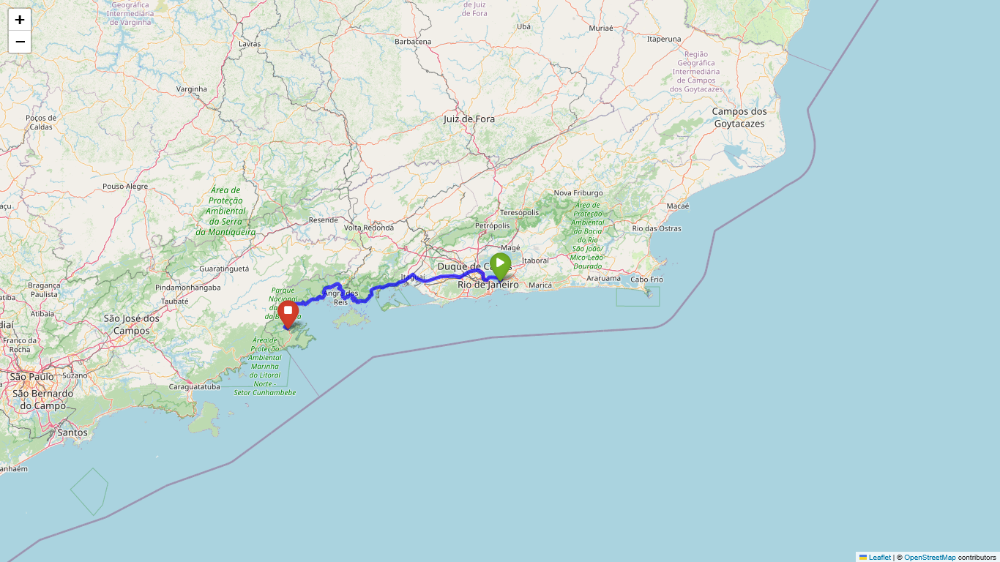

# Utilizando Web API

Este projeto tem como objetivo principal explorar e demonstrar o uso de diversas Web APIs. Atualmente, o foco está na integração com a API do **Open Route Service** para o cálculo de rotas.

---

### Sobre o Projeto

O projeto é um estudo prático de como consumir e processar dados de Web APIs de terceiros. A ideia é criar ferramentas e scripts que utilizem essas APIs para funcionalidades específicas.

---

### Funcionalidade Atual

* **Cálculo de Rotas**: Utiliza a Web API do Open Route Service para determinar a **duração** e a **distância** entre dois ou mais pontos.
* **Visualização de Rotas**: Gera mapas em PNG para visualizar as rotas calculadas.
* **Geração de Relatórios**: Cria um documento em PDF com todas as informações de distância, duração e os mapas das rotas.

---

### Exemplo de Resultado

Abaixo está um exemplo de um dos mapas gerados, mostrando a rota de Niterói para Paraty de carro.



---

### Como Usar (Notebooks Jupyter)

Para rodar os códigos e explorar o projeto, você precisará de um ambiente que suporte notebooks Jupyter, como o JupyterLab ou VS Code.

**Passo 1: Obtenha sua chave da API**

Para obter sua chave, visite [https://account.heigit.org/login](https://account.heigit.org/login), crie uma conta e gere uma nova chave de API.

**Passo 2: Crie os arquivos de configuração**

Antes do primeiro commit, siga estes passos para garantir a segurança da sua chave de API:

1.  Crie um arquivo chamado **`.env`** na raiz do seu projeto. Dentro dele, adicione a sua chave da API.
    
    ```
    # Exemplo de conteúdo do arquivo .env
    ors_api_key = 'SUA CHAVE AQUI'
    ```

2.  Crie um arquivo chamado **`.gitignore`** também na raiz do seu projeto. Adicione a linha abaixo para instruir o Git a ignorar seu arquivo de chaves, impedindo que ele seja enviado para o repositório.
    
    ```
    # Ignora arquivos de variáveis de ambiente
    .env
    ```

**Passo 3: Comece o seu trabalho**

Abra os arquivos `.ipynb` do projeto em seu ambiente Jupyter e execute as células para ver o código em ação. No seu notebook, carregue a chave do arquivo `.env` usando uma biblioteca como `python-dotenv` para acessá-la de forma segura.

---

### Próximos Passos (Concluído)

* [x] Gerar um mapa mostrando os pontos de partida e destino;
* [x] Gerar um documento com o mapa e as informações de distância e duração das rotas.